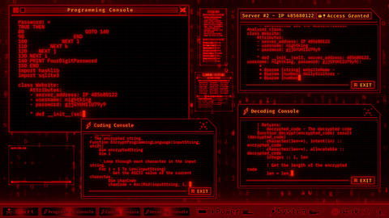
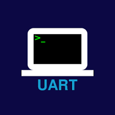
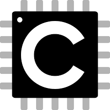
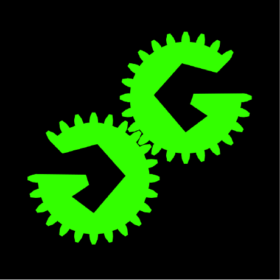

<h1 align="center">🏎 Formula_Student– Building Fast & Secure Automotive Tech 🏎</h1>

<!-- Banner Row -->
<table align="center">
  <tr>
    <td align="center">
      
    </td>
    <td align="center" style="vertical-align: middle;">
      
    </td>
    <td align="center">
      
    </td>
  </tr>
</table>

---

## 👨‍💻 About Me  

> I don’t just write code. I **engineer control**, **penetrate systems**, and **command machines**.  
> Where others see wires, I see warzones. Where they see ECUs, I see entry points.  

 **Automotive Electronics** + **Cybersecurity** => building systems that are not only **fast**, but also **secure and resilient**.

---

<!-- Arsenal + Grid -->
<table align="center" width="100%">
  <tr>
    <!-- Tech Arsenal Column (wider) -->
<td width="420" valign="top" style="padding-right: 20px;">

### ⚙️ Tech Arsenal

#### 🧠 Programming & Modeling  
     

#### 📡 Communication Protocols  
    

#### 🧰 Hardware & Design Tools  
    

#### 🛡 Cybersecurity Toolkit  
  

</td>

<!-- Grid Column -->
<td style="width: 40%; vertical-align: top; padding-left: 10px;">

<table align="center">
  <tr>
    <td></td>
    <td></td>
    <td></td>
    <td></td>
  </tr>
  <tr>
    <td></td>
    <td></td>
    <td></td>
    <td></td>
  </tr>
  <tr>
    <td></td>
    <td></td>
    <td></td>
    <td></td>
  </tr>
  <tr>
    <td></td>
    <td></td>
    <td></td>
    <td></td>
  </tr>
</table>

</td>
  </tr>
</table>

---

## 📬 Get in Touch

  

---

> Tuned for speed. Wired for the unexpected 🏁
